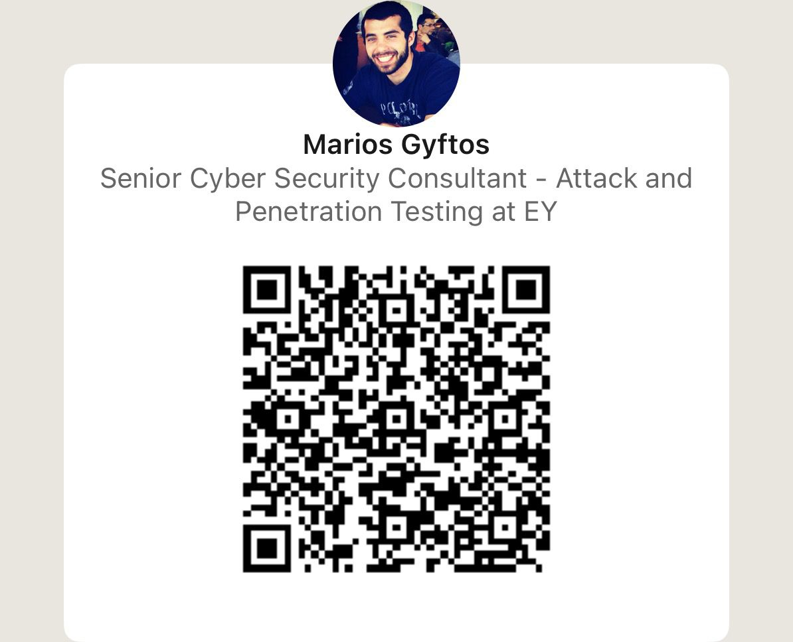
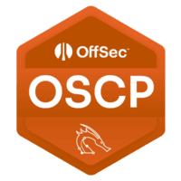
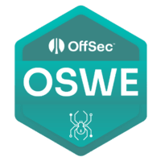

<!-- GitHub Profile README for Marios Gyftos (aka nintendo) -->

  <!-- Banner (add the provided assets/header.svg to your repo) -->
  <h1>Marios Gyftos — Cloud & Offensive Security</h1>

  

    
    
    
    
  

 
   
  Scan to connect on LinkedIn

---

### 👋 Whoami
I'm **Marios Gyftos** (aka **nintendo**) — a senior security consultant and team lead focused on **attack & penetration testing**, **cloud threat emulation**, and **identity abuse** across **Azure, AWS, and GCP**. I publish PoCs, speak at community events, and build practical tools.

> **Disclaimer:** Views are my own; content is for educational purposes only.

---

### 🎤 Talks & Conferences (highlights)
- **May the Least Privilege Be With You: Exposing the Dark Side of Azure Service Principal Permissions (DefCon 2025)** — Dangerous Graph permissions & non‑privileged Entra ID roles; intro to Azure AppHunter.  
  ▶ Session: https://sessionize.com/s/marios-gyftos/may-the-least-privilege-be-with-you-exposing-the-d/143304
- **Cloud Convergence: Interconnected Cloud, DevOps & AD in Pentesting (BSides Athens 2024)**  
  ▶ Session: https://sessionize.com/s/marios-gyftos/cloud-convergence-exploring-the-interconnected-wor/101053
- **The Dark Side of DevOps (BSides Chicago 2023)** — Secrets → CI/CD → Cloud compromise; cloud/AD interconnectivity.  
  ▶ Session: https://sessionize.com/s/marios-gyftos/the-dark-side-of-devops/75154

---

### 🧪 Research & CVEs
- Oracle Health Sciences Applications: **CVE‑2019‑2431** (XSS), **CVE‑2019‑2430** (IDOR), **CVE‑2019‑2432** (PrivEsc)
- Microsoft Dynamics 365: **CVE‑2018‑8607** (XSS)
- Contributor: **Nuages C2**

---

### 🏅 Training · Awards
  
 

Cloud Village CTF: **DEF CON 2025 (2nd)**; **RSA 2025 (1st)**; **DEF CON 2024 (3rd)**, **RSA 2024 (2nd)**; **DEF CON 2023 (2nd)**  
ECSC Greece Team (2017) · Panoptis National Military Cyber‑Defense Exercise — **1st place**

---

### 🧑‍💻 What I’m building
I focus on **cloud identity abuse** (Azure/AWS/GCP), **service principal risk**, and **operator‑friendly tooling**.

> Tip: Pin your top repos so they appear here on the profile.

---

Last updated: 
